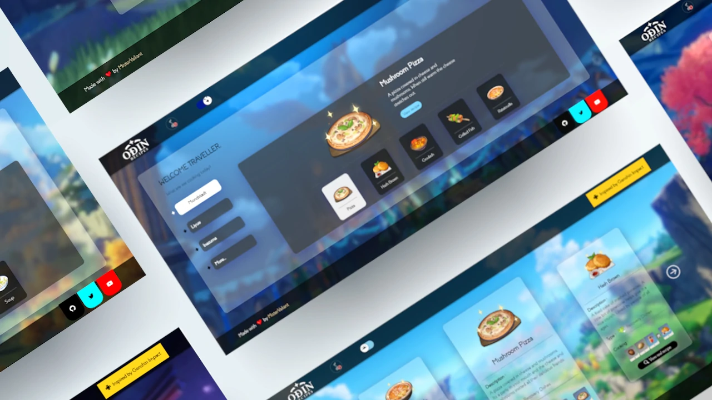

  

 

# 👩‍🍳 Odin Recipes 
> Odin Recipes provides information on my top&nbsp;  5️⃣&nbsp; best realisable dishes from each region in Genshin Impact.

>Live demo:
[https://mistervaliant.github.io/odin-recipes/](https://mistervaliant.github.io/odin-recipes/ "Odin Recipes")

 

## ✒️ General Information 
Ever wanted to have a taste of Mondstadt's , Liyue's or Inazuma's cuisine? 🤔

Odin Recipes provides my top&nbsp; 5️⃣&nbsp; Genshin Impact recipes for each region that can be realised in real-life.

Experience the culinary arts of each region in the ambience of Genshin Impact with theme music, sound effects and sceneries.

**🛈 About Genshin Impact:**

Genshin Impact is an open-world action RPG. Set off on an adventure across Teyvat, a fantasy realm, to recover your missing sibling. You can wander seven different nations, interact with diverse characters with unique personalities and abilities, and engage in battle with them against formidable adversaries. 

 

## ❤️ Motivation
The aim of this project was to revisit the basics of HTML, CSS and Javascript, and further understand the dos and don'ts of Fullstack Web Development using The Odin Project's (TOP) curriculum. Additionally, I always wanted to re-create Genshin Impacts' character selection page from their [website](https://genshin.hoyoverse.com/en/ "Genshin Impact").

 

## 👨‍💻 Technologies Used
Basic HTML, CSS and JavaScript.

 

## 📌 Features

- Day-Night Cycle
- Theme music and sound effects
- Regions' background
- Genshin Impact's recipes in-game and IRL

 

## 📷 Screenshots

 

## 🗺️ Room for Improvement
Issues:
- Sound effects takes time to play when first opened (or after 10 minutes [Github's cache])
- Sliders are created programmatically in Javascript (Not a proper approach).
- Performance issues for mobile devices

 

## 🔗 Acknowledgements
This project was inspired by [Genshin Impact's Character Selection Page](https://genshin.hoyoverse.com/en/ "Genshin Impact")

_Sound Effects:_
- Minecraft's Click
- Discord's mute
- Legend of Zelda BOTW's teleport

_Other References:_
- In-game pictures
- [Genshin Impact Wiki](https://genshin-impact.fandom.com/wiki/Genshin_Impact_Wiki "Genshin Impact Wiki")
- [Genshin Impact Theme](https://www.youtube.com/watch?v=Mcz3yZSUVI8 "Genshin Impact Youtube")

 

## Contact
Created by [@MisterValiant](https://github.com/MisterValiant) - feel free to contact me! 📧

Project Status: **Completed**
